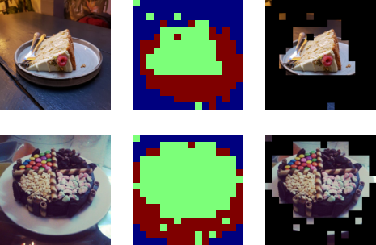

# Simple image foreground co-segmentation using DINOv2 features via Hugging Face

See the contents of the accompanying [Jupyter notebook](index.ipynb) for a simple demonstration of using [DINOv2](https://huggingface.co/docs/transformers/model_doc/dinov2) features for zero-shot image foreground co-segmentation, using the Hugging Face Transformers API. This is a simplified version of the algorithm from ["Deep ViT Features as Dense Visual Descriptors" (Amir et al. 2022)](https://dino-vit-features.github.io/).

